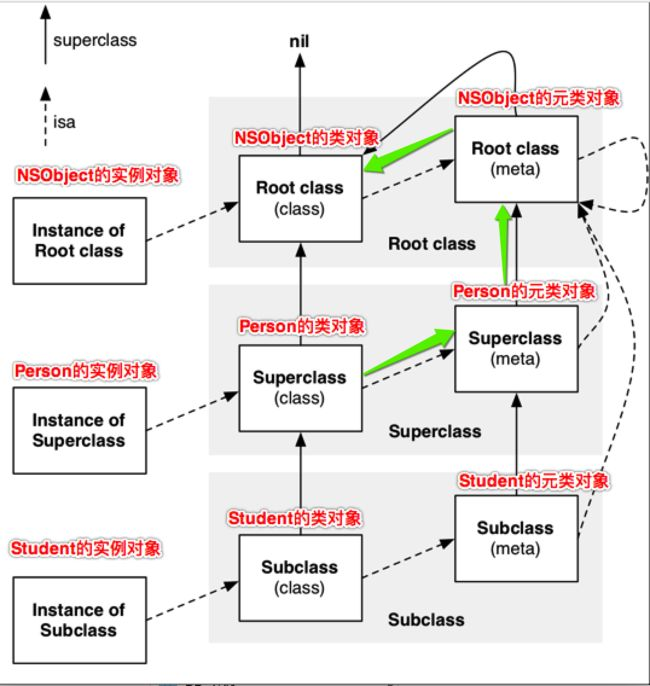
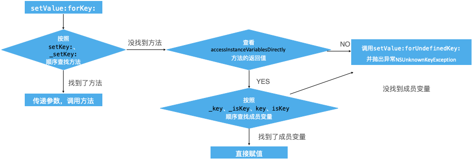
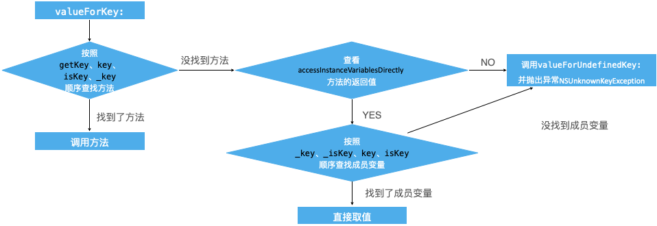

[TOC]


### <font color='pink'>粉色</font>表示问题，提出疑问；<font color='orange'>橘色</font>表示提示，重点提示；<u>下划线</u>表示此问题已解决；

### day1要点

#### 简述


#### 知识点

1. `xcrun -sdk iphoneos clang -arch arm64 -rewrite-objc main.m -o main.cpp；`这是`oc`转`c++`转换命令
2. 在64位系统中，指针是8个字节；为什么呢？因为指针指向的是地址，而想要指向所有地址，指针必须是64位；
3. <font color='pink'><u>为什么Student的getInstanceSize和malloc_size会出现差别呢?如果因为最小16个字节的原因，那么大于16的时候应该是相同的，然而并不是</u>。</font><font color='orange'>答案在day2要点->知识点3</font>
4. [苹果开源网站](https://opensource.apple.com/)
5. 大小端模式，iOS属于小端模式。比如数据0x1234存放在地址0x4000和0x4001上，小端模式是```0x4000:0x34, 0x4001:0x12```, 高位数据`0x12`存放在高位地址`0x4001`上；大端则相反。 
6. NSObject alloc的时候系统会分配16个字节的内存，但是isa指针只会占用8个字节。
7. `class_getInstanceSize实际上是data()->ro->instanceSize`，所以这个数据是不一定准确的。


### day2要点

#### 知识点

1. libmalloc源码;
2. 操作系统的内存对齐;
3. 在iOS系统中，堆空间分配内存都是16的倍数；在libmalloc源码中寻找bucket；<font color='orange'>可以解决要点1中的问题3 第十四、十五节课重点关注</font>;
4. <font color='pink'><u>如果是动态添加`property`，那么`class_getInstanceSize`的返回值会是多少？</u></font><font color='orange'>答案在`day2要点`->知识点4</font>;
5. sizeof是运算符，不是函数。
6. <font color='pink'>类对象和元类对象都是class，他们的结构是一样的，那么类对象中是否有一个结构是元类方法列表呢？在学习方法列表的时候多注意一下；</font><font color='orange'>并不是，他俩的存储位置应该是一样的，只是一个表示的是对象方法，一个表示的是类方法。</font>
7. `class_isMetaClass`的原理应该是在`isa_t`的结构中存有`metaclass`的`flag`标记；
8. <font color='orange'>objc_getClass, ojbect_getClass, class可以从源码的角度来看这三者的区别；</font>
9. gnu内存分配，malloc_alignment<font color='orange'>十五节</font>


#### 解答

1. `__LP64__ `表示`long`和`pointer`都是64位；
2. 求一个数能被8整除的最小数，同理可以推算出被2，4，16，32等整除的最小数

``` objective-c
#   define WORD_MASK 7UL
uint32_t word_align1(uint32_t x) {
    uint32_t t1 = x + WORD_MASK;
    unsigned long t2 = ~WORD_MASK;
    return t1 & t2;
// 精简写法
//    return (x + WORD_MASK) & ~WORD_MASK;
}
```

3. `class_getInstanceSize()`和`malloc_size()`的区别

```objective-c
size_t class_getInstanceSize(Class cls)
{
    if (!cls) return 0;
    return cls->alignedInstanceSize();
}

// Class's ivar size rounded up to a pointer-size boundary.
uint32_t alignedInstanceSize() {
    return word_align(unalignedInstanceSize());
}

static inline uint32_t word_align(uint32_t x) {
    return (x + WORD_MASK) & ~WORD_MASK;
}
    
```

```objective-c
malloc_size(),找了libmalloc和glib，并没有弄清楚。最终通过视频可以知道，在iOS堆中分配内存的最小单位是16；而class_getinstanceSize的最小内存对齐单位是8。
```


4. 如果动态添加`property`，那么`class_getInstanceSize`会发生变化吗？

<font color='orange'>不会发生变化，首先`class_getInstanceSize`他试用的是`data()->ro->instancesize`，而动态添加`property`并不会影响`data()->ro->instancesize`的大小</font>

```objective-c
size_t class_getInstanceSize(Class cls)
{
    if (!cls) return 0;
    return cls->alignedInstanceSize();
}

// Class's ivar size rounded up to a pointer-size boundary.
uint32_t alignedInstanceSize() {
    return word_align(unalignedInstanceSize());
}

// May be unaligned depending on class's ivars.
uint32_t unalignedInstanceSize() {
   assert(isRealized());
   return data()->ro->instanceSize;
}
```

5. object_getClass、objc_getClass和class方法

```objective-c
/*
1. class方法：类对象的class方法返回自己；实例对象的class方法是获取object_getClass方法；
2. object_getClass方法：获取入参的isa指针所指向的对象；
	a. 如果入参obj是实例对象，那么返回的是类对象；
	b. 如果入参obj是类对象，那么返回的是元类对象；
	c. 如果入参obj是元类对象，那么返回的是NSObject根元类对象；
3. objc_getClass方法：根据给出的字符串在加载的类中去查找和字符串匹配的类，如果找到就返回对象的类，如果没有找到就返回nil；
*/

// class
+ (Class)class {
    return self;
}

- (Class)class {
    return object_getClass(self);
}


// object_getClass
Class object_getClass(id obj)
{
    if (obj) return obj->getIsa();
    else return Nil;
}

// objc_getClass
Class objc_getClass(const char *aClassName)
{
    if (!aClassName) return Nil;

    // NO unconnected, YES class handler
    return look_up_class(aClassName, NO, YES);
}

```


### day3要点--isa和superClass

#### 简述

1. 先来看一个示例

```objective-c
// 先定义一个NSObject的category, 添加方法run
@implementation NSObject (Extension)
- (void)run {
    NSLog(@"%p run...", self);
}
@end

  
// 添加自定义类Person(随便自定义一个类)
  
// 然后调用方法
[Person run];

我们知道在向一个对象A发送消息时, 他的调用流程是: 
1. 先找出A.isa指向的类ClassA, 然后查找他的方法列表(先不要纠结缓存的问题), 如果方法列表中找到则直接调用; 
2. 如果没有找到, 会去找ClassA.superClass-->ClassB, 然后查找ClassB的方法列表; 
3. 以此类推, 知道找到这个方法, 如果在NSObject中都没有找到, 那么就会爆出unreginized selctor错误;

我们在向Person类对象发送实例对象消息run消息, 这里应该直接编译报错; 但是这里却有运行结果;

但是运行结果和我们的预期不一样, 我们向一个类对象发送了一个实例方法, 竟然能执行成功. 这是为什么? 下面的内容可以解惑

```


1. 今天主要是根据图片来讲解isa和superClass在oc中的继承关系, 以及在发送消息时的运行流程; 

   

```objective-c


iOS 中的对象分为3类: 实例对象instance, 类对象class, 元类对象metaClass;
1. isa指针的关系
	a. instance.isa         -->  class
	b. class.isa            -->  metaClass
	c. metaClass.isa        -->  metaNSObjectClass
	d. metaNSObjectClass    -->  metaNSObjectClass

2. superClass的关系
// 类对象
	a. studentClass.superClass 			-->  personClass
	b. personClass.superClass				-->  NSObjectClass
  c. NSObjectClass.superClass			-->  nil
  
// 元类对象
  a. metaStudentClass.superClass			-->  metaPersonClass
  b. metaPersonClass.superClass				-->  metaNSObjectClass
  c. metaNSObjectClass.superClass			-->  NSObjectClass

// 我们向Person发送run消息, 首先会找到Person.isa-->metaPersonClass, 查找其方法列表, 没有找到, 然后去找metaPersonClass.superClass-->metaNSObjectClass, 然后查找方法列表还是没有找到, 然后metaNSObjectClass.superClass-->NSObjectClass, 然后查找NSObjectClass的方法列表, 找到了, 然后消息发送成功;
// 这里需要重点关注的是元类对象的c, metaNSObjectClass.superClass			-->  NSObjectClass

```


#### 知识点

1. isa和superclass的关系; 

2. 一般后缀名是_t表示的是table；

3. 想要看清class内部的结构，需要自己手动构建一个和objc_class一样的结构去强制转换；

4. 主要是查看类的内存结构，查看属性的位置，方法列表的位置；

   ```objective-c
   struct objc_class : objc_object {
       // Class ISA;
       Class superclass;
       cache_t cache;             // formerly cache pointer and vtable
       class_data_bits_t bits;    // class_rw_t * plus custom rr/alloc flags
   
       class_rw_t *data() { 
           return bits.data();
       }
    }
   ```

   

5. <font color='orange'>重点查看28节；</font>


### day4要点--KVO

#### 简述

KVO原理: 

1. 为类名为`AClass`的实例对象`AInstance`的属性`age`添加`addObserver`之后, `A.isa`会由之前`AClass`转向`NSKVONotifying_AClass`;
2. 在`NSKVONotifying_AClass`中会重写`setAge:`方法;
3. 在`setAge:`中, 会调用`willChangeVauleForKey:`, `[super setAge:]`, `didChangeValueForKey:`;
4. 其中`willChangeVauleForKey`会记录旧值;
5. `didChangeValueForKey`会发送`observerForKey:`方法;

#### 知识点

1. 在`addObserver`的时候有个参数`context`，可以用作传值，`context`传什么值，在接收的时候就是什么值；

   ```objective-c
   - (void)addObserver:(NSObject *)observer forKeyPath:(NSString *)keyPath options:(NSKeyValueObservingOptions)options context:(nullable void *)context;
   ```

2. 流程addObserver-->替换isa-->重写setter方法

3. 如何验证重写了setter方法？获取IMP实现，查看地址是否一样；

4. iOS的观察者模式和Java的观察者模式不太一样, 需要做个详细的比较; 

5. 如果想要手动触发`observerForKey:`需要同时调用`willChangeVauleForKey`和`didChangeValueForKey`;


### day5要点--KVC&Category

#### 简述

##### KVC_set原理

<font color='orange'>赋值操作会触发KVO操作</font>



```objective-c
1. 首先会查找setKey, _setKey方法, 如果成功, 则直接调用;
2. 没找到方法, 则会检查+ (BOOL)accessInstanceVariablesDirectly方法是否允许访问成员变量;
3. 如果不可以访问则直接进行- (void)setValue:(id)value forUndefinedKey:(NSString *)key(如果存在的话);
4. 如果可以访问成员变量, 则按照_key, _isKey, key, isKey顺序查找变量, 找到直接赋值;
5. 找不到则执行- (void)setValue:(id)value forUndefinedKey:(NSString *)key(如果存在的话);

```


##### KVC_get原理




```objective-c
1. 首先会查找getKey, key, _isKey, _key方法, 如果成功, 则直接调用;
2. 没找到方法, 则会检查+ (BOOL)accessInstanceVariablesDirectly方法是否允许访问成员变量;
3. 如果不可以访问则直接进行- (id)valueForUndefinedKey:(NSString *)keykey(如果存在的话);
4. 如果可以访问成员变量, 则按照_key, _isKey, key, isKey顺序查找变量, 找到直接获取;
5. 找不到则执行- (id)valueForUndefinedKey:(NSString *)key(如果存在的话);
```


##### Category


